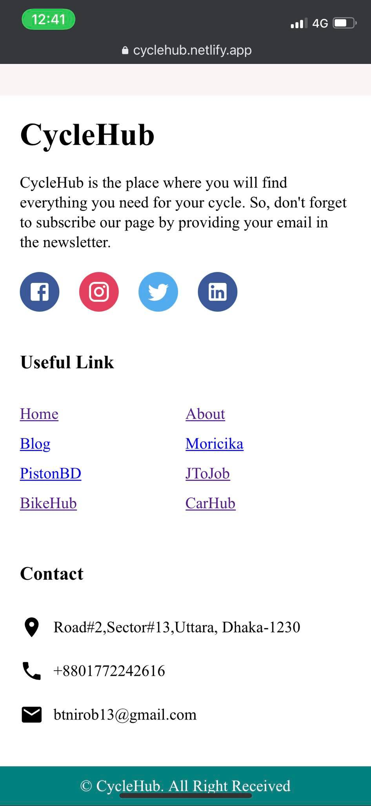

# cyclehub

<a href="https://cyclehub.netlify.app" target="_blank">Go to Website for Better View</a>

  
Table of Contents

  <ol>
    <li>
      <a href="#about-cyclehub">About Cyclehub</a>
      <ul>
        <li><a href="#landing-page">Landing or Home Page</a></li>
        <li><a href="#landing-mobile-view">Home Page Mobile View</a></li>
        <li><a href="#cycle-per-brand">Filtered Cycle By Brand</a></li>
        <li><a href="#single-cycle">Single Cycle</a></li>
        <li><a href="#brands">Brands</a></li>
        <li><a href="#cycles">Cycles</a></li>
        <li><a href="#cycles-mobile-view">Cycles Mobile View</a></li>
        <li><a href="#footer">Footer</a></li>
        <li><a href="#footer-mobile-view">Footer Mobile View</a></li>
      </ul>
    </li>
    <li>
     
  </ol>

<!-- ABOUT CYCLEHUB -->

## about-cyclehub

This webapp is made using react JS for cycle information named Cyclehub.

### landing-page

   

    
   

### landing-mobile-view

   

    
   

### cycle-per-brand

   

    
   

### single-cycle

   

    
   

### brands

   

    
   

### cycles

   

    
   

### footer

   

    
   

### cycles-mobile-view

   

    
   

### footer-mobile-view

   

    
   

   
   Link: https://cyclehub.netlify.app
